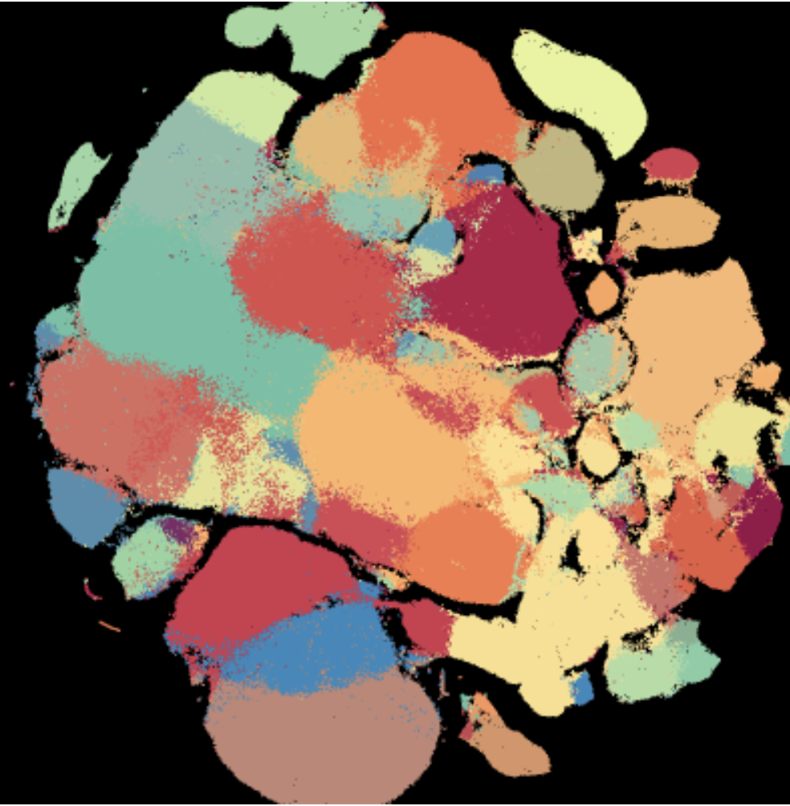
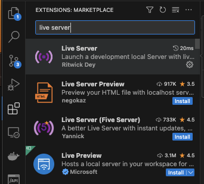

<style>

    .cards {
        display: flex;
        flex-direction:row;
        width: 100%;
        justify-content: flex-start;
        align-items: center;
    }

    .card {
        border-radius: 10px;
        width: 1fr;
        min-width: 100px;
        max-width: 200px;
        min-height: 100px;
        background: gray;
        margin: 20px;

    }
</style>

# WebGL workshop
This is the accompanying repository for a beginner oriented workshop on using WebGL for scientific data visualization. The end result  will be an interactive rendering of 1.5 datapoints on a 2D plain.


<div class="output-image">
    
</div>


# Prerequisites
The target audience is for engineers, developers and scientists with at least some familiarity with browser technology, specifically HTML and Javascript. Otherwise, no experience in WebGL is expected.

This repository houses demo projects inside the `/demos` directory, each is self contained and can be hosted with a simple http server.

## Hosting the source code
Follow any of the choices below to host the directory with a simple http file server. Then view the pages at [`http://localhost:5500`](http://localhost:5500)


`vscode`
1. Open VsCode
2. Open marketplace
<div style="margin-left: 200px">
    
</div>

3. Open directory in live server
    <div style="margin-left: 20px">
    <span style="color:limegreen"> via the UX</span>
    <br/>
    1. open command palette `Cmd+P`
    2. type "open live server" to start
    3. repeat with "close live server" to close

    <br />
    <span style="color:limegreen"> via the terminal</span>
    <br/>
    1. `Cmd+L,Cmd+O` to open
    2. `Cmd+L,Cmd+C` to close
    </div>
    

`python`
```bash
$ python -m SimpleHTTPServer 5500
```


`nodejs`
```bash
$ npm install http-server -g
$ http-server -p 5500
```


# Demos
The purpose of these demos is to give a progressive and iterative walkthrough of simple programs building up to a more complex visualization. The learning objective is to focus on the primary graphics pipeline of (a) writing shader programs and (b) passing data to the shader programs during animation. Other parts of the necessary setup are abstracted into convenience packages provided by the authors of the `WebGL:Programming Guide` book. 

### Demo 01 - Single point

### Demo 02 - Customize size and color

### Demo 03 - Drawing many elements

### Demo 04 - Fancy Fragment Shader

### Demo 05 - Adding interactivity

